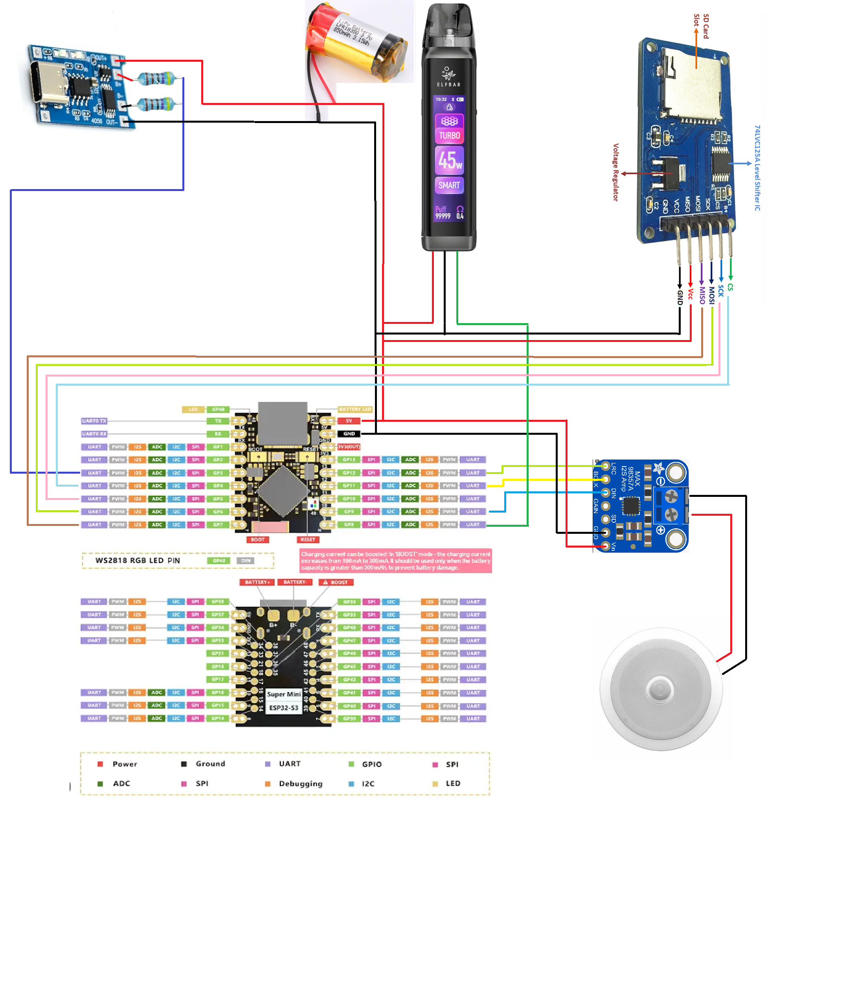

# ELMA IoT


ELMA IoT stands for Elnur Mehdiyev Automation and Internet of Things. This project is a custom PlatformIO firmware base for ESP32 and ESP32-S3 home automation devices with a browser-based configuration UI, MQTT and Home Assistant integration, local storage management, GitHub-release-based update discovery, and configurable pin mapping for audio, OLED, battery, SD, and status hardware.

Project story and current device write-up:

- Drive2 article: https://www.drive2.ru/c/735319567747779562/


## Current Release

- Firmware version: `v0.1.24`
- Primary release repository: `elma-iot/ELMA-IoT`
- GitHub Releases feed: `https://api.github.com/repos/elma-iot/ELMA-IoT/releases`
- Default ESP32-S3 HACS asset: `esp32s3-notifier-hacs-v0.1.24.bin`

This version is intended to be published as a standard GitHub release using the normal OTA asset names without a prerelease suffix.

Latest release highlights:

- OTA installs now detect stalled downloads, retry from the last written offset when the server supports HTTP range requests, and reboot the device after repeated failures instead of leaving it hung mid-update.
- OTA recovery now surfaces retry and restart phases explicitly so the device comes back operational after broken firmware downloads.
- Web asset bundling now uses a cross-platform `npx` launcher so GitHub Actions release verification works on Linux runners as well as Windows development machines.

## What This Firmware Does

- Plays MP3, internet radio, URL streams, and TTS over I2S audio.
- Targets the MAX98357A mono amplifier path for the ceiling-speaker ESP32-S3 build.
- Exposes a local web UI for playback, Wi-Fi, MQTT, battery, OLED, GPIO reference, storage, firmware, and device monitoring.
- Exposes a Configuration workspace with board-aware peripheral planning, pin remapping, and a dynamic wiring diagram for the active build.
- Publishes MQTT state and accepts MQTT playback, transport, OTA, and control commands.
- Supports Home Assistant through standard MQTT topics and the HACS `mqtt_media_player` flow.
- Browses GitHub Releases for matching firmware assets and supports local firmware uploads.
- Supports OLED status display, touch buttons, buzzer, battery monitoring, low-battery sleep, SD storage, configurable pin mapping, and a broader peripheral catalog for audio, inputs, displays, storage, communications, controls, sensors, and expanders.

## Hardware Target

The current documented target is the ESP32-S3 Super Mini ceiling-speaker build using:

- ESP32-S3 Super Mini
- MAX98357A I2S mono amplifier
- Ceiling speaker connected directly to the amplifier output
- 0.96 inch I2C OLED display
- Two TTP223 touch buttons
- Active buzzer

Repository hardware references:

- Circuit diagram: [Docs/circuit.png](Docs/circuit.png)
- ESP32-S3 pinout image: [Docs/esp32-s3_pinout.jpeg](Docs/esp32-s3_pinout.jpeg)
- 3D assets: [3D](3D)
- STL folder: [3D/STL](3D/STL)
- Device story article: https://www.drive2.ru/c/735319567747779562/



## Default ESP32-S3 Wiring

The ESP32-S3 environments in [platformio.ini](platformio.ini) default to this ceiling-speaker wiring:

| Function | GPIO |
|---|---:|
| I2S DOUT / DIN | 9 |
| I2S LRCLK / WS | 12 |
| I2S BCLK | 11 |
| Status LED | 10 |
| Battery ADC | 3 |
| OLED SDA | 4 |
| OLED SCL | 5 |
| Touch button 1 | 5 |
| Touch button 2 | 6 |
| Buzzer | 7 |
| SD CS | 4 |
| SD SCK | 5 |
| SD MOSI | 6 |
| SD MISO | 7 |

Notes:

- ESP32-S3 audio pin remapping is intentionally limited to the supported `GPIO9` to `GPIO12` I2S set.
- OLED, battery, LED, buzzer, and SD pins are sanitized to avoid active audio and required-function conflicts.
- The documented amplifier path for the ceiling-speaker profiles is MAX98357A only.

## Audio Path

Audio playback uses `schreibfaul1/ESP32-audioI2S` on the standard I2S path required by MAX98357A.

Important current behavior:

- The firmware uses standard I2S format, not a PCM5102-specific path.
- The earlier software-side audio boost that could clip or distort playback was removed.
- Active stream replacement uses fade-out and fade-in for smoother station switching.
- The Audio tab supports direct Radio Browser station switching while already playing.
- The hero playback card includes previous station, play or stop, and next station controls.
- The browser default radio selection is Azerbaijan with AvtoFM preselected.
- SD mounting now prefers 40 MHz first and falls back through 20, 10, 4, 1, and 0.4 MHz for cards or wiring that need a slower clock.

There is also a dedicated diagnostic build for isolated MAX98357A testing:

- `esp32s3_notifier_hacs_audio_test`

That profile is for troubleshooting and is not part of the standard release asset matrix.

## Sound Effects And Automation

Runtime automation and local sound-effect routing are coordinated in [src/main.cpp](src/main.cpp), [src/audio_player.cpp](src/audio_player.cpp), and [src/sound_effects.cpp](src/sound_effects.cpp).

Current behavior:

- Configurable effect-file routing is available for startup, alarm, notification, ambient, low-battery, shutdown, update-available, and update-success events.
- Ambient selection now starts the dedicated ambient playback source, resumes automatically after other playback stops, and keeps non-ambient effect dropdowns as one-shot previews.
- Ambient and alert cues can be selected from local storage and triggered without replacing the normal release asset flow.
- Remembered last-played stream and media selections now keep both the last source and whether it was stopped or active, so a reboot restores the correct stopped-versus-playing behavior instead of always resuming.
- Effect-file previews now use the full stop-preview-resume path, which restores interrupted playback more reliably after one-shot preview sounds finish or fail.
- Startup effects are now deferred briefly after boot and retried across transient SD mount instability so boot cues can start after the device finishes its early storage bring-up.
- Active SD-backed playback now keeps storage-summary reads on cached values so background status polling does not probe the card mid-stream.
- Live SD-to-SD playback switches now add a short settle delay and remount-retry path so changing SD-backed effects no longer drops into a false missing-file or SD removal state.
- SD folder navigation now keeps the requested path in sync with the rendered list during playback-safe cached views.
- SD folder paging now keeps loading indexed batches during playback instead of stopping at the first 20 entries.
- Low-battery handling can play a cue before entering deep sleep when that mode is enabled.
- OTA availability and success cues can be paired with the firmware action flow.

## Web UI

The web frontend lives in [web/index.html](web/index.html), [web/style.css](web/style.css), and [web/app.js](web/app.js), then gets embedded into firmware by [scripts/asset_embed.py](scripts/asset_embed.py).

Current UI highlights:

- Hero header with live firmware version, release channel badge, and author link.
- Header gear menu with inline refresh, reboot, and shutdown actions.
- Centered reboot countdown overlay that waits for reconnect before forcing a refresh.
- Live Wi-Fi, MQTT, playback, battery, heap, and firmware status.
- Hardware Monitor cards for CPU load, SRAM, PSRAM, flash FS, SD, and board metadata.
- MQTT discovery now also exposes chip CPU temperature to Home Assistant as a retained temperature sensor.
- Radio Browser country and station selection with recent playback history.
- Direct URL playback and TTS playback entry.
- Previous, play or stop, and next station transport controls from the top playback card.
- Audio Effects tab for assigning local files to startup, alert, ambient, and OTA cues.
- Audio Effects ambient playback now uses the real looping ambient source and automatically returns after manual playback or streams stop.
- Configuration tab with board selection, peripheral-profile selectors, conflict-aware GPIO mapping, and a live peripheral diagram.
- Peripheral diagram editing with draggable modules, label editing, node rotation, saved layout, and label-based rewiring.
- I2S pin remapping for MAX98357A wiring.
- OLED pin remapping plus display-mode selection between OLED and Wape trigger mode.
- Battery configuration, charging-sense pin selection, calibration helpers, and low-battery sleep controls.
- MQTT tab connect or disconnect control plus a dedicated Republish Discovery button for Home Assistant rediscovery.
- Motor tab runtime config now stores learned open or closed position, movement roles, and touch-button motor actions on the device instead of relying on browser state.
- GPIO Info tab with board selector, dedicated SVG board art, side-by-side pin guidance, and board suitability recommendations.
- Internal flash and SD storage tabs with file browsing, folder creation, upload support, selection tools, and SD pin configuration.
- SD storage playback now starts immediately from the preview modal and toolbar play action without blocking on artwork scans.
- SD reindex actions now stop playback first and then continue automatically instead of only showing a blocker message.
- Firmware release browsing, local firmware upload, and firmware action dashboard.
- Password reveal toggles, reboot, and factory-reset actions, with backup and restore available from the Device tab.
- Embedded favicon served from the device web UI.

## Configuration Tab And Peripheral Capabilities

The Configuration area is intended to let the device be adapted beyond the default ceiling-speaker wiring. The current frontend supports board-aware planning, persistent peripheral profile selection, helper bindings for unsupported combinations, and a dynamic wiring diagram that reflects the active configuration.

Current configuration capabilities:

- Board selector with autodetect-aware ESP board guidance and SVG board imagery.
- Conflict-aware pin sanitization for audio, OLED, SD, battery ADC, charging sense, status LED, and Wape trigger paths.
- Persistent peripheral-profile selection stored in browser UI state and reused across sessions.
- Dynamic peripheral diagram with drag positioning, label editing, rotation, saved layouts, and automatic wire routing.
- Diagram rewiring that can map current peripheral labels onto board labels and apply matching GPIO assignments.
- Storage-aware local file routing for sound effects and external-storage browsing, uploads, folder creation, deletion, reindex, and preview playback.

Current peripheral slot counts:

- Audio outputs: up to 3
- Audio inputs: up to 3
- Displays: up to 2
- Sensors: up to 10
- Inputs: up to 10
- Storage devices: up to 3
- Communication modules: up to 4
- Control devices: up to 16
- Expansion devices: up to 4

Supported peripheral profiles currently exposed by the Configuration tab:

Audio output profiles:

- None
- MAX98357A I2S Amp
- PCM5102 I2S DAC
- UDA1334A I2S DAC
- ES9023 I2S DAC
- PT8211 I2S DAC
- CS4344 I2S DAC
- Internal DAC GPIO25/26
- PWM / Class-D Amp
- Analog Line-Out via DAC
- PAM8403 Analog Amp
- TPA3110 / TPA3116 Analog Amp
- Buzzer
- WM8960 Audio Codec
- ES8388 Audio Codec
- Bluetooth Audio Source
- Custom

Audio input profiles:

- None
- I2S Microphone Generic
- INMP441 I2S Mic
- SPH0645 / ICS-43434 I2S Mic
- MSM2615 I2S Mic
- PDM Microphone
- Analog Electret Mic ADC
- MAX9814 Mic ADC
- MAX4466 Mic ADC
- Line-In ADC
- External I2S ADC
- ES7243 / ES7210 I2S ADC
- WM8960 Audio Codec
- ES8388 Audio Codec
- Bluetooth Audio Sink
- Custom

Display profiles:

- None
- I2C OLED
- SPI TFT
- Waveshare Screen
- Custom

Sensor profiles:

- None
- BNO055
- BNO085 / BNO080
- MPU6050
- DS18B20
- Battery Voltage Divider (2x 220kOhms)
- Custom

Input profiles:

- None
- TTP223 Touch Button
- Physical Button
- Toggle Switch
- Rotary Encoder
- IR Receiver
- PIR Motion Sensor
- Reed Switch
- Limit Switch
- Joystick Analog
- Analog Potentiometer
- ESP32 Native Touch Pad
- Water Leak / Rain Sensor
- Vibration / Shock Sensor
- Hall Sensor
- Flow Meter Pulse Sensor
- Keypad Matrix
- RF 433MHz Receiver
- Wake Button
- Custom

Storage profiles:

- None
- MicroSD SPI
- MicroSD SDMMC
- Custom

Communication profiles:

- None
- UART
- RS485
- LoRa E22/E220
- I2C
- SPI
- Custom

Control profiles:

- None
- Servo
- Dual Servo
- PWM Fan
- DC Motor Driver Generic
- DRV8833 Dual Motor Driver
- TB6612FNG Dual Motor Driver
- L298N Dual Motor Driver
- BTS7960 High Power Motor Driver
- Stepper Driver A4988 / DRV8825
- Stepper Driver TMC2208 / TMC2209
- Relay Module
- MOSFET Switch
- Solenoid / Valve Driver
- LED / PWM Dimmer
- WS2812 / NeoPixel LED Strip
- Buzzer
- Vibration Motor
- Pump Driver
- Custom

Expansion profiles:

- None
- I2C GPIO Expander
- MCP23017 16-bit I/O Expander
- PCF8574 8-bit I/O Expander
- PCF8575 16-bit I/O Expander
- Shift Register 74HC595 Output Expander
- Shift Register 74HC165 Input Expander
- Analog Multiplexer CD4051 / 74HC4051 8-channel
- Analog Multiplexer CD74HC4067 16-channel
- External ADC ADS1115 16-bit I2C
- External ADC ADS1015 12-bit I2C
- External ADC MCP3008 SPI
- External DAC MCP4725 I2C
- PWM Expander PCA9685
- Custom

## Build Profiles

Release-oriented PlatformIO environments:

- `esp32_notifier`
- `esp32_notifier_hacs`
- `esp32_notifier_hacs_slim`
- `esp32s3_notifier`
- `esp32s3_notifier_hacs`
- `esp32s3_notifier_hacs_slim`

Additional diagnostic environment:

- `esp32s3_notifier_hacs_audio_test`

Default workspace target in [platformio.ini](platformio.ini):

- `esp32s3_notifier_hacs`

## 4MB Flash Layout

The current full-web release profiles are configured around 4MB hardware.

Current release behavior:

- ESP32 and ESP32-S3 release builds now use [partitions/ota_4m.csv](partitions/ota_4m.csv) with two OTA app slots so failed updates and bootloops can roll back to the previous firmware.
- [platformio.ini](platformio.ini) also sets `board_upload.flash_size = 4MB` for the ESP32-S3 environments to avoid generating an invalid 8MB image header.
- To make both OTA slots large enough for the current full-web images on 4MB hardware, the internal flash filesystem partition is removed from this layout.
- This preserves true OTA redundancy on 4MB boards while still avoiding the ESP32-S3 boot failure caused by flashing an 8MB-image header onto 4MB hardware.

If your board reports only `4096k` flash, use the current configuration as-is. OTA redundancy is available again, but internal flash storage is not.

## Build And Flash

Build the current default environment:

```powershell
pio run
```

Build a specific environment:

```powershell
pio run -e esp32s3_notifier_hacs
```

Upload:

```powershell
pio run -t upload
```

List serial devices:

```powershell
pio device list
```

Open the serial monitor:

```powershell
pio device monitor -b 115200
```

If flashing an ESP32-S3 fails to connect cleanly, hold `BOOT`, start upload, and release `BOOT` after `Connecting...` appears.

## VS Code Tasks

This workspace already includes PlatformIO-oriented tasks. The most useful ones are:

- `PlatformIO: Verify`
- `PlatformIO: Upload (Auto Port)`
- `PlatformIO: Monitor (Auto Port)`
- `PlatformIO: List Serial Devices`

There are also optional fixed-port monitor and upload tasks for boards that stay on a stable COM port.

## First Boot And Provisioning

On startup the firmware:

1. Loads saved settings from Preferences when available.
2. Falls back to compile-time defaults from [include/default_config.h](include/default_config.h) otherwise.
3. Attempts Wi-Fi station mode when credentials are configured.
4. Starts fallback AP mode if station credentials are missing or connection fails.

Fallback AP defaults:

- SSID prefix: `ELMA-IoT-XXXXXX`
- Password: `12345678`
- Config page: `http://192.168.4.1`

Default generated device identity:

- ESP32 builds: `elma-iot-xxxxxx`
- ESP32-S3 builds: `elma-iot-xxxxxx`

## MQTT And Home Assistant

Default base topic:

- `elma_iot`

Typical command topics:

- `esp32_notifier/cmd/play`
- `esp32_notifier/cmd/tts`
- `esp32_notifier/cmd/stop`
- `esp32_notifier/cmd/volume`
- `esp32_notifier/cmd/ota/select_version`
- `esp32_notifier/cmd/ota/install_version`

Typical state topics:

- `esp32_notifier/availability`
- `esp32_notifier/state/playback`
- `esp32_notifier/state/network`
- `esp32_notifier/state/battery`
- `esp32_notifier/state/battery_percent`
- `esp32_notifier/state/battery_charging`
- `esp32_notifier/state/volume`

Example play payload:

```json
{"url":"https://example.com/stream.mp3","label":"Test Stream","type":"stream"}
```

Example volume payload:

```json
{"volumePercent":55}
```

For Home Assistant media-player style control, use the HACS-oriented build with `bkbilly/mqtt_media_player`:

- Recommended ESP32-S3 build: `esp32s3_notifier_hacs`
- Vendored backup integration: [home_assistant/custom_components/mqtt_media_player](home_assistant/custom_components/mqtt_media_player)

When running multiple notifier devices on the same broker, keep these values unique per device:

- MQTT Client ID
- MQTT Base Topic
- Device Name
- Friendly Name

Home Assistant rename behavior:

- Changing only MQTT Client ID or Base Topic does not rename the Home Assistant device entry.
- MQTT discovery identity is derived from Device Name and Friendly Name.
- If an older device name is still shown in Home Assistant after a rename, remove the old device entry or clear the retained discovery topics for the old device name.

Current MQTT behavior:

- The MQTT tab can republish Home Assistant discovery without disconnecting the broker session.
- Generic broker reachability failures now keep retrying instead of forcing a device recovery reboot.
- Credential or client-ID rejections still surface as an explicit frontend error.
- Automatic broker reconnect now uses the same configure-and-connect path as the manual Connect button.
- Motor valve discovery now uses an optimistic switch entity so Home Assistant does not bounce the control back before state catches up.
- Motor state publishes now fire immediately for both MQTT-triggered and web-triggered valve movement.
- CPU temperature is published as a dedicated retained MQTT state topic and discovered in Home Assistant as a standard temperature sensor.

Current OTA and rollback behavior:

- OTA rollback bookkeeping now suppresses harmless `Preferences` `NOT_FOUND` log spam on normal boots when no pending or bad-version keys exist in NVS.
- OTA release downloads now treat a no-progress socket as a stalled transfer after 15 seconds, retry up to three resumed HTTP range requests, and force a recovery reboot if the download still cannot progress.
- If the firmware host does not support OTA resume after a stall, the device aborts the update and reboots back into the current firmware instead of staying stuck in a busy flashing state.

## Firmware And Releases

The Firmware tab checks GitHub Releases by default and matches the expected asset name to the running build variant.


Release asset names for `v0.1.24`:

- `esp32-notifier-v0.1.24.bin`
- `esp32-notifier-hacs-v0.1.24.bin`
- `esp32-notifier-hacs-slim-v0.1.24.bin`
- `esp32s3-notifier-v0.1.24.bin`
- `esp32s3-notifier-hacs-v0.1.24.bin`
- `esp32s3-notifier-hacs-slim-v0.1.24.bin`

GitHub release publishing is automated by [.github/workflows/platformio.yml](.github/workflows/platformio.yml): publishing a release triggers CI to build the six standard release variants and upload the matching OTA assets back to that release.

## Battery Monitoring

Battery monitoring is implemented in [src/battery_monitor.cpp](src/battery_monitor.cpp).

Current ESP32-S3 default behavior:

- The ESP32-S3 Super Mini profiles use `GPIO3` for voltage sensing.
- The default ESP32-S3 calibration multiplier is `2.0`.
- On some ESP32-S3 Super Mini boards this reflects a built-in VBUS divider rather than a true direct cell-voltage measurement.
- Battery MQTT discovery now exposes battery voltage, battery percentage, and charging state to Home Assistant.
- An optional charging-sense pin can be assigned and is now used directly for charging detection when configured.
- If no charging-sense pin is configured, charging falls back to filtered voltage-trend detection.
- Device settings now include low-battery sleep enablement, threshold percentage, and wake interval controls.

If the reported voltage is off, recalibrate it from the Battery tab using a multimeter measurement.

Important: if the battery voltage is indicated incorrectly and low-battery sleep is enabled, the device can enter deep sleep and stop being reachable from the web interface. While the device is connected to USB, open the Device tab and disable deep sleep until the measured voltage is corrected to match the real level and stay above the configured deep-sleep threshold.

## OLED Support

OLED support is handled by [src/display_manager.cpp](src/display_manager.cpp).

Current behavior:

- SSD1306 and SH1106 displays are supported.
- Display mode can switch between a normal OLED renderer and a Wape trigger mode.
- OLED pins can be remapped from the UI.
- Wape mode can fire a trigger pin on device start, playback start, or charging start.
- OLED pin choices are sanitized to avoid clashes with audio, battery, LED, SD, and other reserved functions.
- Only one display mode is intended to be active at a time.

## Storage Support

Storage management covers both internal flash and optional SD media.

Current behavior:

- Internal flash storage is available only when the selected partition table includes a flash filesystem partition.
- SD storage can be enabled and pinned through the UI.
- The web UI supports browsing, folder creation, upload actions, bulk selection controls, and in-browser preview helpers for available storage targets.
- SD pin choices are checked against active audio, battery, and status pin assignments.
- Storage summary polling now uses cached SD values during active SD reads so ambient and other SD-backed playback are not interrupted by status refreshes.

## Repository Layout

Key files and directories:

- [platformio.ini](platformio.ini)
- [partitions/ota_4m.csv](partitions/ota_4m.csv)
- [partitions/single_4m.csv](partitions/single_4m.csv)
- [include/default_config.h](include/default_config.h)
- [include/settings_schema.h](include/settings_schema.h)
- [include/version.h](include/version.h)
- [src/main.cpp](src/main.cpp)
- [src/audio_player.cpp](src/audio_player.cpp)
- [src/settings_manager.cpp](src/settings_manager.cpp)
- [src/ota_manager.cpp](src/ota_manager.cpp)
- [src/web_server.cpp](src/web_server.cpp)
- [web/index.html](web/index.html)
- [web/style.css](web/style.css)
- [web/app.js](web/app.js)
- [home_assistant](home_assistant)
- [3D](3D)
- [Docs](Docs)

## Known Limitations

- Native Home Assistant core MQTT discovery alone is still not enough for a first-class `media_player` entity on the standard build.
- Some streams and codecs may still require library-side tuning depending on the source.
- Firmware size is still tight, especially on ESP32-S3 4MB hardware.
- Basic web auth is supported, but it remains simple HTTP auth rather than a full access-control model.
- The project is output-only audio. No microphone or duplex voice path is implemented.

## Release Notes

Current release notes live here:

- [release-assets/v0.1.24/release-notes.md](release-assets/v0.1.24/release-notes.md)
